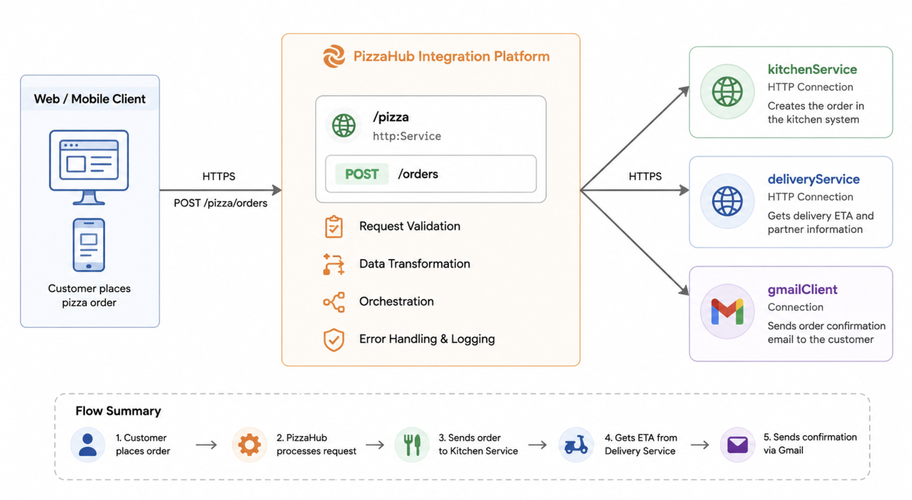
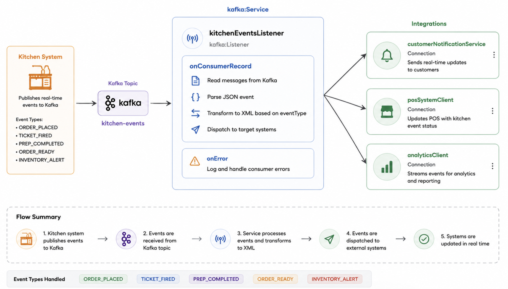
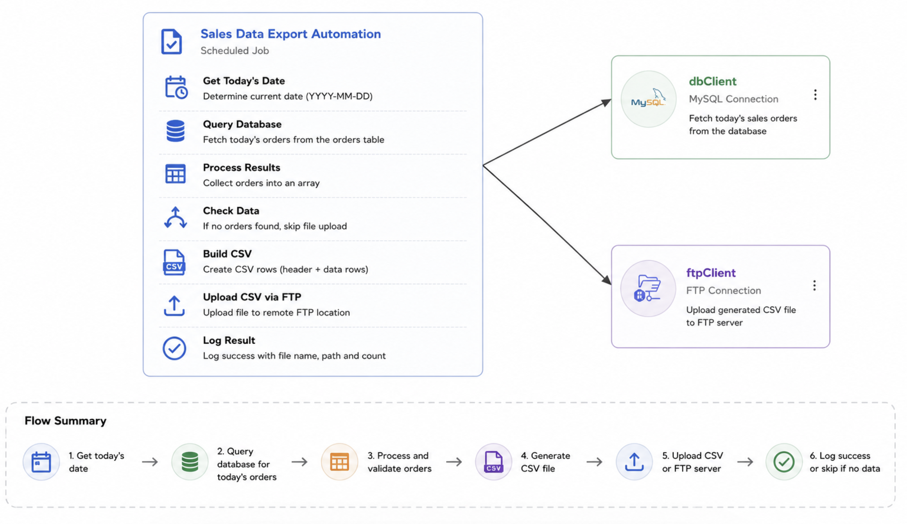

# 2026 WSO2Con AUS Integration Tutorial 1

Welcome to the PizzaHub integration project used in the **WSO2Con Integration Tutorial: Low-Code and Pro-Code Integration Made Simple**. 🍕

This project demonstrates how to build modern enterprise integrations using the WSO2 Integration Platform by combining APIs, automations, events, and legacy integrations.

---
## Prerequisites

To Develop Integrations:
- [WSO2 Integrator](https://wso2.com/integration-platform/docs/get-started/setup/local-setup) installed.
- Optional - [Gmail API](https://central.ballerina.io/ballerinax/googleapis.gmail/4.2.0#setup-guide) access

To Deoply Integrations:
- [GitHub](https://github.com/signup) account
- [WSO2 Cloud](https://console.devant.dev/) account

## Architecture Overview

This project contains three integrations:

| Integration | Type | Purpose |
|---|---:|---|
| Order-Processor | API Integration | Handles customer order placement and orchestrates downstream systems |
| Kitchen-Events-Processor | Event Integration | Processes real-time kitchen events and updates systems |
| Sales-Data-Aggregator | Automation | Generates and sends sales reports |

---

## Scenario Overview

### Scenario 1 — Order Processing API



The customer places a pizza order using a mobile/web application.

Flow:

```text
Customer App
    |
POST /pizza/orders
    |
    +--> Transform Request
    +--> Send Order → Kitchen System
    +--> Request Delivery ETA → Delivary System
    +--> Send confirmation email
    +--> Return Unified Response
```

Capabilities demonstrated:

- API exposure
- Data transformation
- Multi-system orchestration
- Using connectors
- Low-code + pro-code development

Sample request:

```json
{
  "customerId": "CUST-1001",
  "customerName": "John Silva",
  "phone": "+1-512-555-0198",
  "address": "123 Main St, Austin, TX",
  "items": [
    {
      "pizza": "Margherita",
      "size": "Large",
      "quantity": 1
    },
    {
      "pizza": "Pepperoni",
      "size": "Medium",
      "quantity": 2
    }
  ]
}
```

Sample response:

```json
{
  "orderId": "ORD-10045",
  "status": "CONFIRMED",
  "estimatedReadyTime": 20,
  "deliveryPartner": "QuickDrop",
  "deliveryEtaMinutes": 35
}
```

**Kitchen Service**

URL - https://e8f34e4e-e9bb-4799-b725-7173d271fa62-prod.e1-us-east-azure.choreoapis.dev/2on2026-ntegration/kitchenservice/v1.0

Resource  `/orders`

Sample Request : 

```json
{
   "items":[
      {
         "pizza": "Pepparoni",
         "quantity": 2,
         "size": "L"
      },
      {
         "pizza": "Cheese",
         "quantity": 1,
         "size": "M"
      }
   ],
   "orderId": "Odlsl1"
}
```

Sample Response : 

```json
{
  "orderId": "SSKASK",
  "status": "ACCEPTED",
  "etaMinutes": 11
}
```

**Delivary Service**

URL - https://e8f34e4e-e9bb-4799-b725-7173d271fa62-prod.e1-us-east-azure.choreoapis.dev/2on2026-ntegration/delivaryservice/v1.0


---

### Scenario 2 — Kitchen Event Processing



Kitchen systems publish order events in real time.

Flow:

```text
Kitchen System
    |
Kitchen Events
    |
    +--> Process Event
    +--> Update Customer Notifications
    +--> Update POS Dashboard
    +--> Update Analytics
```

Capabilities demonstrated:

- Event-driven architecture
- Event consumption
- Parallel execution
- Real-time integrations

---

### Scenario 3 — Sales Data Automation



Generate daily sales reports automatically.

Flow:

```text
Scheduler
    |
    +--> Fetch Orders
    +--> Aggregate Data
    +--> Transform to CSV
    +--> Upload via SFTP
```

Capabilities demonstrated:

- Scheduled jobs
- Batch processing
- File generation
- SFTP integration

---

## Running the Project

### Start integrations

Run from the project root:

```bash
bal run
```

Or run individual integrations:

```bash
cd integrations/Order-Processor
bal run
```

---

## Test Order API

Send a request:

```bash
curl -X POST http://localhost:8080/pizza/placeOrder \
-H "Content-Type: application/json" \
-d @sample-order.json
```

---

## What You Learned

✅ API integrations  
✅ Event-driven integrations  
✅ Automations  
✅ File integrations  
✅ Data transformations  
✅ Multi-system orchestration  
✅ Low-code + pro-code development  
✅ Cloud / On-Premise deployment

---

Built with ❤️ using WSO2 Integration Platform
